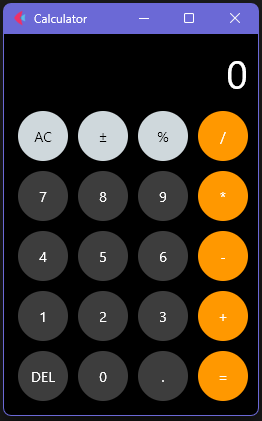

# 📱 iPhone Calculator

A sleek calculator app inspired by the iPhone design, built entirely with [Flet](https://flet.dev) — a Python framework for creating beautiful front-end apps without HTML, CSS, or JavaScript.



---

## 🚀 Demo

> Smooth interface, animated buttons, custom `ink` effects and clean layout — ideal for showcasing UI capabilities with Python.

---

## 🛠️ Tech Stack

- [Python 3.11+](https://www.python.org)
- [Flet](https://flet.dev) – UI framework for Flutter-like apps in Python
- [Poetry](https://python-poetry.org) – Dependency management and packaging

---

## 📦 Installation

```bash
# Clone the repository
git clone https://github.com/your-username/iphone-calculator.git
cd iphone-calculator

# Install dependencies
poetry install

# Run the app
poetry run python src/iphone_calculator/main.py
```
---

## 📁 Project Structure

iphone-calculator/
│
├── src/
│   └── iphone_calculator/
│       └── main.py
│       └── components/         # (if modularized)
│
├── README.md
├── pyproject.toml
└── .gitignore

---

## ✨ Features

◉ Minimalistic and responsive UI
◉ iOS-like visual design
◉ Ink and shadow effects on button tap
◉ Basic math operations: add, subtract, multiply, divide
◉ Dynamic color logic for button effects

---

## 🧪 In Progress
 Keyboard input support

 Parentheses and advanced expressions

 Calculation history

 Web deployment using flet.app

 ---

## 👨‍💻 Author

Made with ☕ by Rafael Melo (@rafael-melo)

---

## 📄 License

Distributed under the [MIT](LICENSE).